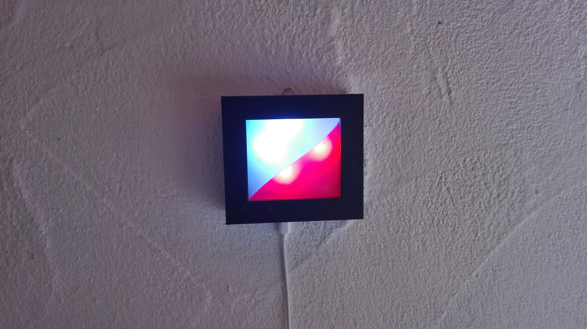

# weatherframe

Display weather forecase on neopixels in a frame

(LEDs are hard to photograph)

Adopted from [Becky Sterns Instructions](https://www.instructables.com/id/WiFi-Weather-Display-With-ESP8266)

This runs on a wemos D1_mini, Nodemcu or compatible ESP8266 board. By default the
board is configured to connect to a strip of 4 WS2812 LEDs but the number can
be adjusted in the source. The strip is split into two equal segments to display
a two color pattern for the upcoming weather condition.

## Configuration and Setup

The LEDs must be connected to NodeMCU/D1-Mini pin `D1`

Configuration of Wifi and the location for the forecast is done with the help of [WifiManager](https://github.com/tzapu/WiFiManager). On the first time the application creates a wifi access point with the name `weatherframe-XXXXX`. Connect to it to setup the device.

The location parameter must be set to a wunderground location path e.g. `q/DE/Berlin`. You can look up the location path using `http://autocomplete.wunderground.com/aq?query=Berlin` and use the field `l` as the value. 

If you ever need to reconfigure the application, reset it twice within 10s and the device will start the configuration access point again.

### Have fun -- be creative
